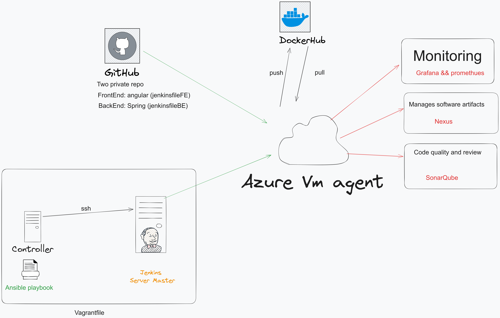

# Project DevOps of fifth year:

## Introduction 

As part of fifth year project in Esprit university , I have implemented a CD/CI pipeline to an existing spring/Angular web application using Jenkins.

## Tools and technologies used in this project

- **Vagrant**:  IAC infrastructure as code vagrantfile contains two node one the Master node which contains the ansible roles and the other is the jenkins server.
- **Ansible**: ansible roles to installe various packeges such docker, docker compose, Java 11 , maven and Jenkins.
- **Jenkins**: Two nodes : the first one run locally as the jenkins master and the second as the worker node run in the cloud in Microsoft azure virtual machine.
- **Github**: contain Two private repository :
	 1. FrontEnd with Angular
	 2. BackEnd with spring 
 

## Architecture

## Steps:
- Step 1: Jenkins Pipeline Creation
- Step 2: Develop Unit Tests for the Backend  Application
- Step 3: Build Backend (Spring Boot)
- Step 4: Build Frontend (Angular)
- Step 5: Deploy Backend to Nexus
- Step 6: Run SonarQube Analysis
- Step 7: Push Docker Images to Docker Hub
- Step 8: Deploy Backend/Frontend with MySQL using  Docker Compose
- Step 9: Send Emails

## Realisation 

